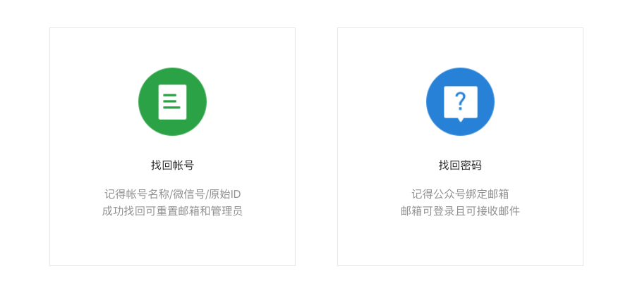
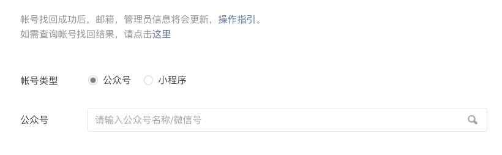
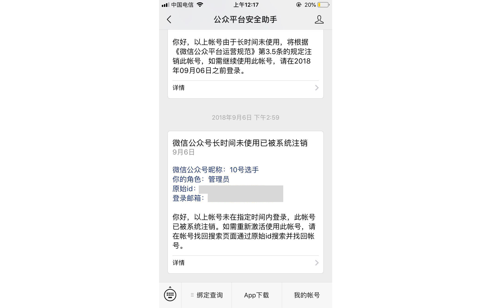
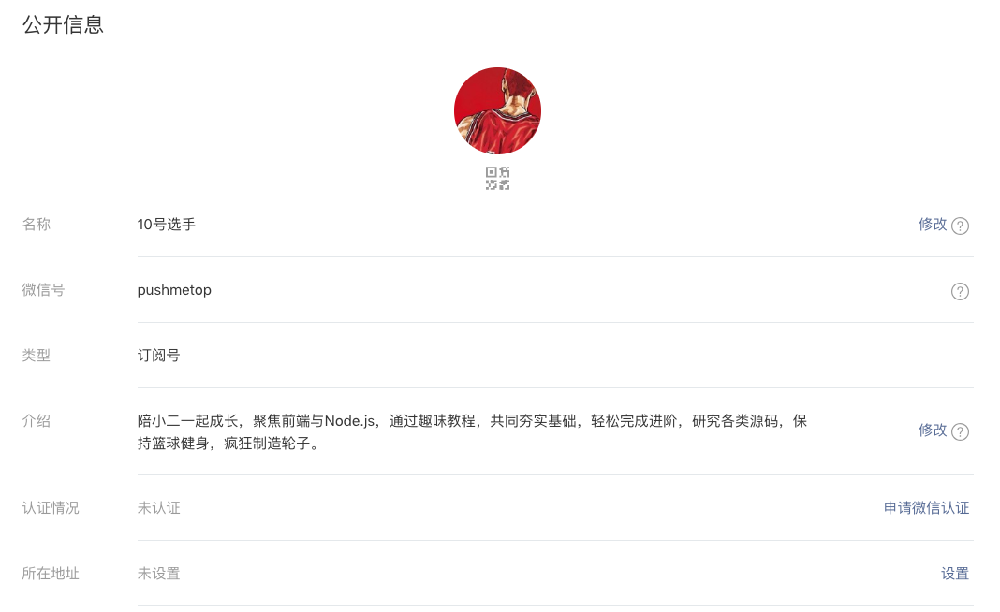

<!-- # 公众号风波 -->

## 前言

> 微信公众号、留言开通、账号迁移、注意事项

小二最近收到一些小伙伴的私信说`文章没有留言功能`，小二查阅了一下才发现微信公众平台写着：

> 根据相关法律法规和平台规则要求，我们暂时调整留言功能开放规则，后续新注册帐号无留言功能，感谢您的支持！

## 被注销

原来在 `2018年2月` 新账号就已经不支持公众号的留言申请，小二想起来自己以前学习 `微信开发的时候` 注册过一个账号 `10号选手`，急急忙忙打开微信公众号平台登录才发现：

> 微信公共号平台超过210天不登录便会被自动注销。

## 某宝

通过`搜索`发现可以通过 `账号迁移`，把原来有 `留言功能` 的账号迁移到 `无留言功能` 的账号。这下开心死小二了，于是乎打开万能的某宝搜索并和客服聊了起来：

开通留言功能整个费用为 `1580` 元是相当昂贵了，可是小二想花这个钱却没有办法花出去：

> 个人账号没法接收迁移开通留言

## 求助大佬

小二求助了一下 `KRIS不只是一只鱼头` 大佬，大佬告诉小二他的账号也是被注销过通过官方的 `找回账号` 恢复回来。鱼头真是非常 nice 的哥哥，帮助小二不止一次了，非常感谢鱼头哥哥。

> 官方注销的账号可以通过找回账号恢复。

> 鱼头哥哥还单身，小姐姐们可以撩他哦！

## 找回账号

打开公众号的页面选择找回账号：

按操作一步步执行：

小二发蒙了 `公众号` 居然也有着自己的微信号，虽然涨知识了可是小二已经忘记公众号了。在一番搜索后了解到 `公众号` 被注销时会通过 `公众平台安全助手` 发送一条关于注销的消息：

输入公众号后会发送一条邮件到你的邮箱中，通过认证就能完成公众号的找回。最后再使用 `密码找回` 将密码修改后即可登录：

## 总结

如果同学也准备开始写 `微信公众号` 需要注意的是：

* 微信`个人`公众号不支持 `账号迁移`。
* 微信公众号从 `2019年2月` 开始申请的账号 `不支持` 留言功能。
* 微信公众号的 `订阅号` 和 `企业号` 可以通过 `带留言功能`的账号迁移 来开通留言。
* 某宝在 `2019年4月` 开通费用为 `1580元` 可能还会涨价。
* 微信公众号可以找有账号的`朋友` 通过 `公众号设置>注册信息` 来修改账号。

小二喜欢和大家`留言互动`准备把账号都切换到新公众号上，大家如果还想关注小二可以扫描下面的新二维码进行关注。

最后谢谢`鱼头`哥哥对我的帮助，`鱼头` 哥哥天天都在学习和阅读文档，输出很多小二都不知道的 `CSS` 知识，并且励志在 `无障碍` 推广方面下功夫，小二很喜欢他说过的一句话：

> 无障碍道路虽然艰难，但是不过有没有人关注`勿忘初心`。

> 对鱼头哥哥感兴趣的可以关注他的公众号 `鱼头的Web海洋`。

## 一起成长

> 在困惑的城市里总少不了并肩同行的 `伙伴` 让我们一起成长。

* 如果您想让更多人看到文章可以点个 `点赞`。
* 如果您想激励小二可以到 [Github](https://github.com/zhangxiangliang/30-seconds-for-everyday) 给个 `小星星`。

> 本文原稿来自 [ZhangXiangLiang](https://github.com/zhangxiangliang)